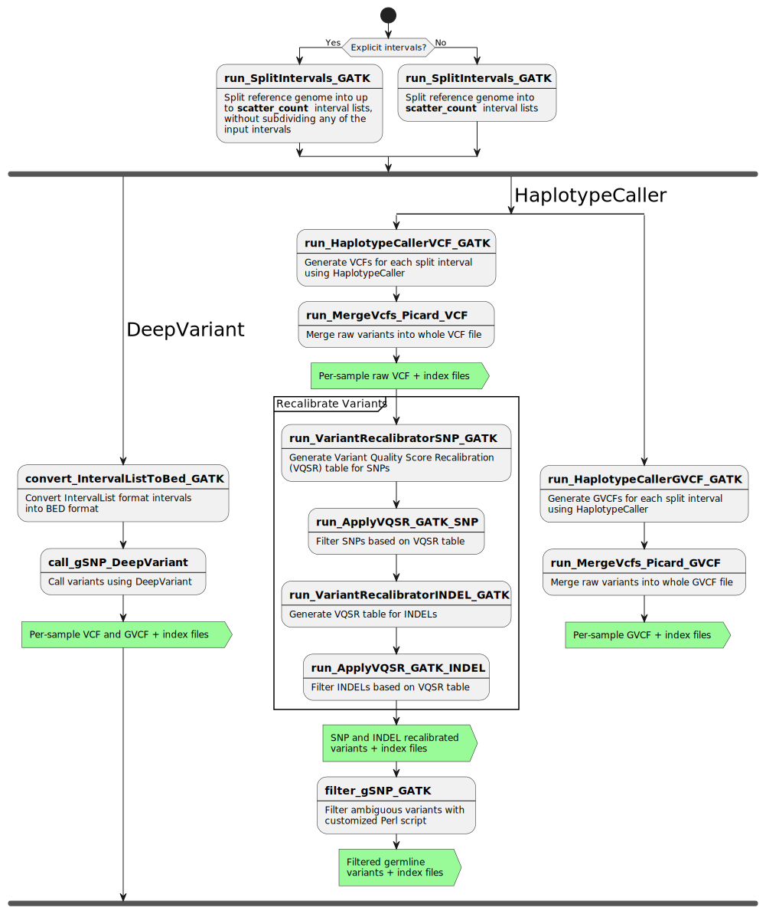

# call-gSNP

1. [Overview](#overview)
2. [How To Run](#how-to-run)
3. [Flow Diagram](#flow-diagram)
4. [Pipeline Steps](#pipeline-steps)
5. [Inputs](#inputs)
5. [Outputs](#outputs)
6. [Discussions](#discussions)
7. [Contributors](#contributors)
8. [References](#references)

## Overview

This pipeline takes BAMs and corresponding indices from [recalibrate-BAM](https://github.com/uclahs-cds/pipeline-recalibrate-BAM) and runs through GATK4 best practice to call germline short variant (SNP and INDEL). It can be run with any combination of normal and tumor samples (normal only, tumor only, normal-tumor paired, multiple normal and tumor samples).

---

## How To Run

**The pipeline is currently configured to run on a SINGLE NODE mode with normal only, tumor only, normal-tumor paired, or multiple normal and tumor samples.**

1. Update the params section of the .config file ([Example config](config/template.config)).

2. Update the YAML.

3. Download the submission script (submit_nextflow_pipeline.py) from [here](https://github.com/uclahs-cds/tool-submit-nf), and submit your pipeline below.

> **Note**: Because this pipeline uses an image stored in the GitHub Container Registry, you must follow the steps listed in the [Docker Introduction](https://uclahs-cds.atlassian.net/wiki/spaces/BOUTROSLAB/pages/3223396/Container+Registry+-+GitHub+Packages) on Confluence to set up a PAT for your GitHub account and log into the registry on the cluster before running this pipeline.

- YAML input
```
python submit_nextflow_pipeline.py \
       --nextflow_script /path/to/main.nf \
       --nextflow_config /path/to/call-gSNP.config \
       --nextflow_yaml /path/to/sample.yaml \
       --pipeline_run_name job_name \
       --partition_type <type> \
       --email email_address
```
---

## Flow Diagram



---

## Pipeline Steps

### 1. Split genome or target intervals into sub-intervals for parallelization
Use the input target intervals or the whole genome intervals and split them into sub-intervals for parallel processing.

### 2.	HaplotypeCaller
Generate VCF for each split interval using HaplotypeCaller. Generate GVCF for SNPs and INDELs.

### 3. Merge raw VCFs and GVCFs
Merge raw variants from each interval.

### 4. VQSR - SNPs
Generate VQSR (Variant Quality Score Recalibration) model for SNPs.

### 5. VQSR - INDELs
Generate VQSR model for INDELs.

### 6. VQSR - Apply SNP model
Take the whole sample raw VCF from Step 3 as input, and apply the model in Step 4 to generate variants in which only SNPs are recalibrated.

### 7. VQSR Apply INDEL model
Take the output from Step 6 as input, and apply the model in Step 5 to recalibrate only INDELs.

#### Steps 4 through 7 model the technical profile of variants in a training set and uses that to filter out probable artifacts from the raw VCF. After these four steps, a recalibrated VCF is generated.

### 8. Filter gSNP – Filter out ambiguous variants
Use customized Perl script to filter out ambiguous variants.

### 9. Generate sha512 checksum
Generate sha512 checksum for VCFs and GVCFs.

---

## Inputs

### Input YAML

| Field | Type | Description |
|:------|:-----|:------------|
| patient_id | string | Patient ID (will be standardized according to data storage structure in the near future) |
| normal_BAM | path | Set to absolute path to normal BAM |
| tumor_BAM | path | Set to absolute path to tumor BAM |

```
---
patient_id: "patient_id"
input:
  BAM:
    normal:
      - "/absolute/path/to/BAM"
      - "/absolute/path/to/BAM"
    tumor:
      - "/absolute/path/to/BAM"
      - "/absolute/path/to/BAM"

```

For normal-only or tumor-only samples, exclude the fields for the other state.

### Config

| Input Parameter | Required | Type | Description |
|:----------------|:---------|:-----|:------------|
| `dataset_id` | Yes | string | Dataset ID |
| `blcds_registered_dataset` | Yes | boolean | Set to true when using BLCDS folder structure; use false for now |
| `output_dir` | Yes | string | Need to set if `blcds_registered_dataset = false` |
| `save_intermediate_files` | Yes | boolean | Set to false to disable publishing of intermediate files; true otherwise; disabling option will delete intermediate files to allow for processing of large BAMs |
| `cache_intermediate_pipeline_steps` | No | boolean | Set to true to enable process caching from Nextflow; defaults to false |
| `scatter_count` | Yes | integer | Number of intervals to divide into for parallelization |
| `intervals` | Yes | path | Use all .list in inputs for WGS; Set to absolute path to targeted exome interval file (with .interval_list, .list, .intervals, or .bed suffix) |
| `reference_fasta` | Yes | path | Absolute path to reference genome fasta file, e.g., `/hot/ref/reference/GRCh38-BI-20160721/Homo_sapiens_assembly38.fasta` |
| `bundle_mills_and_1000g_gold_standard_indels_vcf_gz` | Yes | path | Absolute path to Mills & 1000G Gold Standard Indels file, e.g., `/hot/ref/tool-specific-input/GATK/GRCh38/Mills_and_1000G_gold_standard.indels.hg38.vcf.gz` |
| `bundle_v0_dbsnp138_vcf_gz` | Yes | path | Absolute path to dbsnp file, e.g., `/hot/ref/tool-specific-input/GATK/GRCh38/resources_broad_hg38_v0_Homo_sapiens_assembly38.dbsnp138.vcf.gz` |
| `bundle_hapmap_3p3_vcf_gz` | Yes | path | Absolute path to HapMap 3.3 file, e.g., `/hot/ref/tool-specific-input/GATK/GRCh38/hapmap_3.3.hg38.vcf.gz` |
| `bundle_omni_1000g_2p5_vcf_gz` | Yes | path | Absolute path to 1000 genomes OMNI 2.5 file, e.g., `/hot/ref/tool-specific-input/GATK/GRCh38/1000G_omni2.5.hg38.vcf.gz` |
| `bundle_phase1_1000g_snps_high_conf_vcf_gz` | Yes | path | Absolute path to 1000 genomes phase 1 high-confidence file, e.g., `/hot/ref/tool-specific-input/GATK/GRCh38/1000G_phase1.snps.high_confidence.hg38.vcf.gz` |
| `work_dir` | optional | path | Path of working directory for Nextflow. When included in the sample config file, Nextflow intermediate files and logs will be saved to this directory. With ucla_cds, the default is `/scratch` and should only be changed for testing/development. Changing this directory to `/hot` or `/tmp` can lead to high server latency and potential disk space limitations, respectively. |
| `docker_container_registry` | optional | string | Registry containing tool Docker images. Default: `ghcr.io/uclahs-cds` |
| `base_resource_update` | optional | namespace | Namespace of parameters to update base resource allocations in the pipeline. Usage and structure are detailed in `template.config` and below. |

#### Base resource allocation updaters
To update the base resource (cpus or memory) allocations for processes, use the following structure and add the necessary parts. The default allocations can be found in the [node-specific config files](./config/)
```Nextflow
base_resource_update {
    memory = [
        [['process_name', 'process_name2'], <multiplier for resource>],
        [['process_name3', 'process_name4'], <different multiplier for resource>]
    ]
    cpus = [
        [['process_name', 'process_name2'], <multiplier for resource>],
        [['process_name3', 'process_name4'], <different multiplier for resource>]
    ]
}
```
> **Note** Resource updates will be applied in the order they're provided so if a process is included twice in the memory list, it will be updated twice in the order it's given.

Examples:

- To double memory of all processes:
```Nextflow
base_resource_update {
    memory = [
        [[], 2]
    ]
}
```
- To double memory for `run_ApplyVQSR_GATK` and triple memory for `run_validate_PipeVal` and `run_HaplotypeCallerVCF_GATK`:
```Nextflow
base_resource_update {
    memory = [
        ['run_ApplyVQSR_GATK', 2],
        [['run_validate_PipeVal', 'run_HaplotypeCallerVCF_GATK'], 3]
    ]
}
```
- To double CPUs and memory for `run_ApplyVQSR_GATK` and double memory for `run_validate_PipeVal`:
```Nextflow
base_resource_update {
    cpus = [
        ['run_ApplyVQSR_GATK', 2]
    ]
    memory = [
        [['run_ApplyVQSR_GATK', 'run_validate_PipeVal'], 2]
    ]
}
```

---

## Outputs

| Output | Description |
|:-------|:------------|
| `<GATK>_<dataset_id>_<sample_id>.g.vcf.gz` | Per-sample GVCF |
| `<GATK>_<dataset_id>_<sample_id>.g.vcf.gz.sha512` | Per-sample GVCF checksum |
| `<GATK>_<dataset_id>_<sample_id>.g.vcf.gz.tbi` | Per-sample GVCF index |
| `<GATK>_<dataset_id>_<sample_id>.g.vcf.gz.tbi.sha512` | Per-sample GVCF index checksum |
| `<GATK>_<dataset_id>_<patient_id>.vcf` | Raw variant calls |
| `<GATK>_<dataset_id>_<patient_id>.vcf.idx` | Raw variant calls index |
| `<GATK>_<dataset_id>_<patient_id>_VQSR-SNP-AND_INDEL.vcf.gz` | SNP and INDEL recalibrated variants |
| `<GATK>_<dataset_id>_<patient_id>_VQSR-SNP-AND_INDEL.vcf.gz.sha512` | SNP and INDEL recalibrated variants checksum |
| `<GATK>_<dataset_id>_<patient_id>_VQSR-SNP-AND_INDEL.vcf.gz.tbi` | SNP and INDEL recalibrated variants index |
| `<GATK>_<dataset_id>_<patient_id>_VQSR-SNP-AND_INDEL.vcf.gz.tbi.sha512` | SNP and INDEL recalibrated variants index checksum |
| `<GATK>_<dataset_id>_<patient_id>_snv.vcf.gz` | Filtered SNVs with non-germline and ambiguous variants removed |
| `<GATK>_<dataset_id>_<patient_id>_snv.vcf.gz.tbi` | Filtered germline SNVs index |
| `<GATK>_<dataset_id>_<patient_id>_snv.vcf.gz.sha512` | Filtered germline SNVs sha512 checksum |
| `<GATK>_<dataset_id>_<patient_id>_indel.vcf.gz` | Filtered INDELs with non-germline and ambiguous variants removed |
| `<GATK>_<dataset_id>_<patient_id>_indel.vcf.gz.tbi` | Filtered germline INDELs index |
| `<GATK>_<dataset_id>_<patient_id>_indel.vcf.gz.sha512` | Filtered germline INDELs sha512 checksum |
| `report.html`, `timeline.html` and `trace.txt` | Nextflow report, timeline and trace files |
| `*.command.*` | Process specific logging files created by nextflow |

---

## Discussions

- [Issue tracker](https://github.com/uclahs-cds/pipeline-call-gSNP/issues) to report errors and enhancement ideas.
- Discussions can take place in [call-gSNP Discussions](https://github.com/uclahs-cds/pipeline-call-gSNP/discussions)
- [call-gSNP pull requests](https://github.com/uclahs-cds/pipeline-call-gSNP/pulls) are also open for discussion

---

## Contributors

Please see list of [Contributors](https://github.com/uclahs-cds/pipeline-call-gSNP/graphs/contributors) at GitHub.

---

## References

--

## License

Authors: Yash Patel (YashPatel@mednet.ucla.edu), Shu Tao (shutao@mednet.ucla.edu), Stefan Eng (stefaneng@mednet.ucla.edu)

Call-gSNP is licensed under the GNU General Public License version 2. See the file LICENSE for the terms of the GNU GPL license.

Call-gSNP takes BAM files and utilizes GATK to call short germline variants (SNP and INDEL).

Copyright (C) 2021-2023 University of California Los Angeles ("Boutros Lab") All rights reserved.

This program is free software; you can redistribute it and/or modify it under the terms of the GNU General Public License as published by the Free Software Foundation; either version 2 of the License, or (at your option) any later version.

This program is distributed in the hope that it will be useful, but WITHOUT ANY WARRANTY; without even the implied warranty of MERCHANTABILITY or FITNESS FOR A PARTICULAR PURPOSE. See the GNU General Public License for more details.
